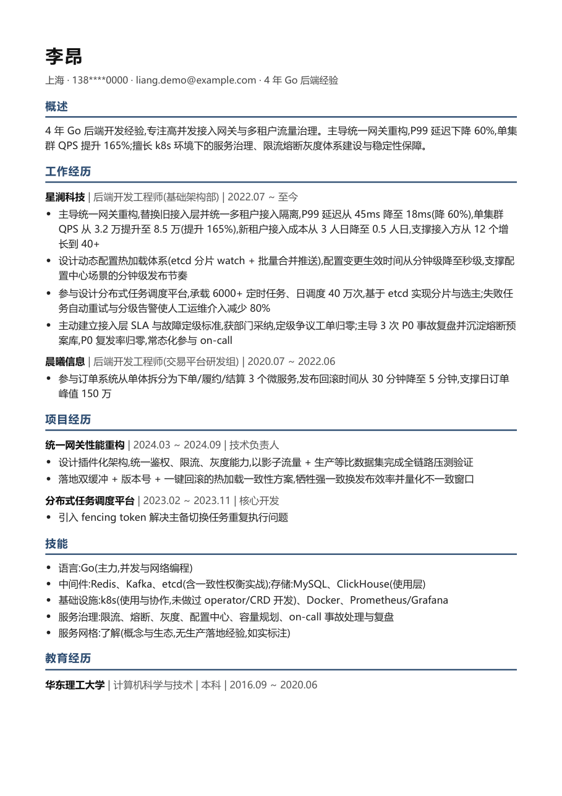
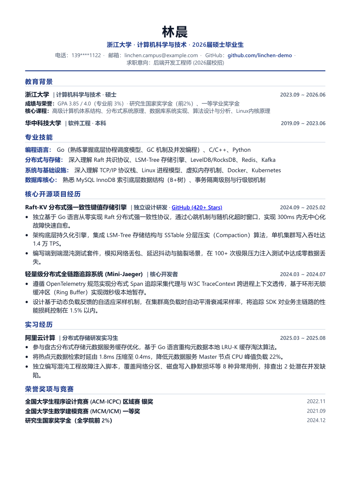
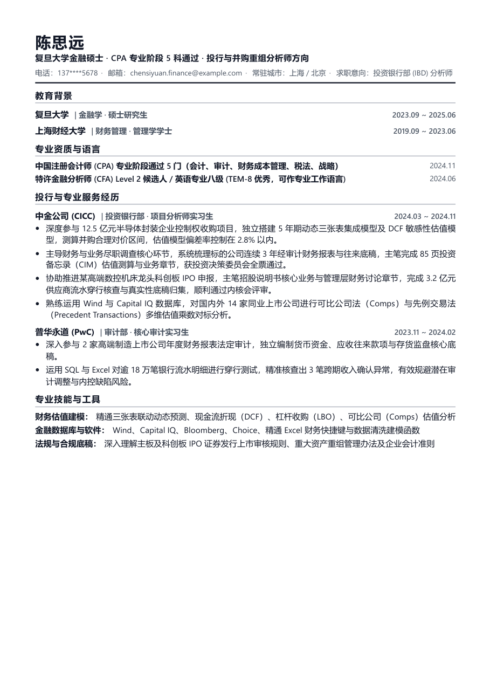
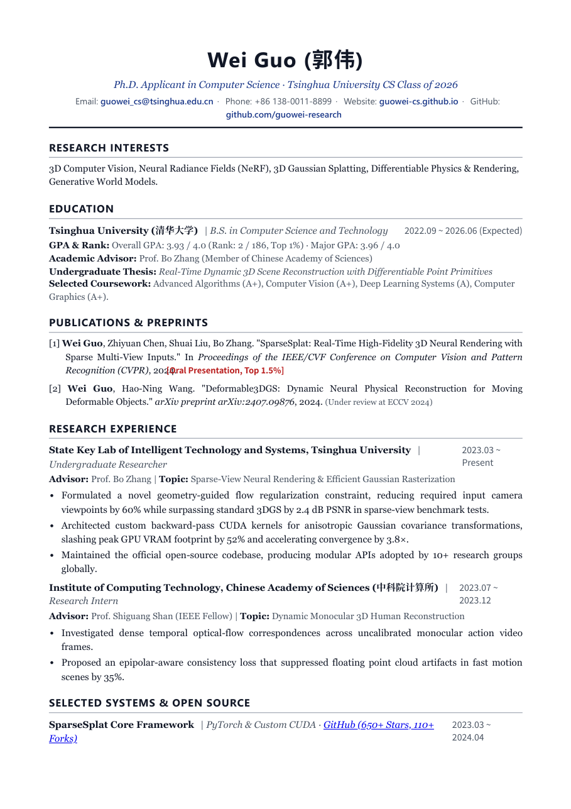
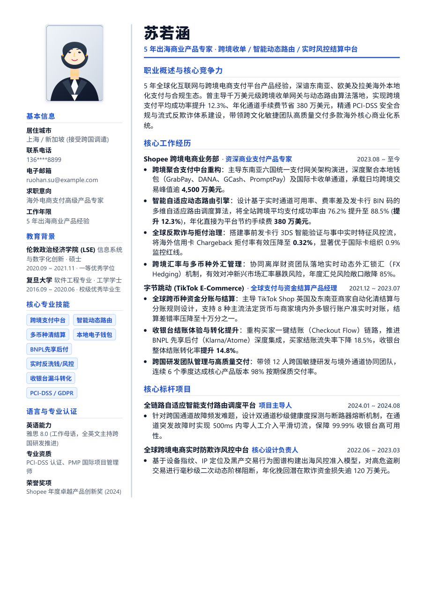

# CareerExpert — 全能型 AI 原生职业生涯与学术工作流系统

<p align="center">
  
  
  
  
</p>

> **将你的职业生涯当作严肃的软件工程来运维。**  
> 做你最严苛的简历主编、最敏锐的代码工程审计师与最专业的求职/学术军师。  
> 告别千篇一律的套话，告别粗制滥造的网络模板，基于**代码级工程事实与 Google XYZ 战果量化**，全流程支撑你的每一次职涯跃迁。
> 
> **全场景覆盖**：社招资深技术 · 校招应届高潜 · 金融投行商业 · 出国留学学术 CV (Harvard/MIT 规范)。  
> **全流程贯穿**：简历全格式导入 $\rightarrow$ 代码库工程探测 $\rightarrow$ JD 深度评估 $\rightarrow$ 乐高排版渲染 $\rightarrow$ 看板追踪 $\rightarrow$ 四级模拟面试 $\rightarrow$ Offer 谈判。

---

## 🚀 30 秒极速安装 (Quick Installation)

本项目遵循 **Anthropic 官方 Plugin & Skills 规范**，支持一键将 Multi-Skills 技能矩阵与原生 Slash 命令注入各大 AI Agent CLI：

### Windows (PowerShell)
```powershell
# 克隆仓库后在根目录运行一键安装器
git clone https://github.com/alvinluo-tech/CareerExpert.git
cd CareerExpert
.\install.ps1 -Target All
```

### macOS / Linux (Bash)
```bash
git clone https://github.com/alvinluo-tech/CareerExpert.git
cd CareerExpert
chmod +x install.sh
./install.sh all
```

> **一键部署全套生态**：
> - **Claude Code 全局**：自动部署技能至 `~/.claude/skills/`，并安装原生 Slash 命令至 `~/.claude/commands/`（支持 `/resume`, `/style`, `/polish`, `/cv`, `/interview`）；
> - **Antigravity 全局**：自动部署技能至 `~/.gemini/config/skills/`；
> - **OpenAI Codex 全局**：自动部署技能至 `~/.codex/skills/` 并加载 `.codex-plugin/plugin.json`；
> - **Cursor / 本地项目**：通过 `.cursorrules` 与 `plugin.json` 自动生效。

---

## 🏗️ Multi-Skills 技能矩阵与 Slash 命令架构

根目录保持极致清爽，核心能力拆分为**高内聚、专精垂直领域的独立技能矩阵**，并配备原生 **Slash 快捷指令**：

```text
CareerExpert/
├── README.md                           <-- [项目门面] 完整说明、安装指南与 Prompt 速查
├── LICENSE                             <-- [开源协议] MIT License
├── install.sh / install.ps1            <-- [跨平台安装器] 一键部署全套技能矩阵至各大 Agent
├── docs/                               <-- [工程设计文档] (仅存仓库，不分发给用户环境)
├── .claude-plugin/                     <-- 🌟 [Claude Code 官方插件清单]
│   ├── plugin.json                     <--   遵循 Anthropic 官方 schema，注册 5 大技能
│   └── marketplace.json                <--   插件市场分发清单
├── .codex-plugin/                      <-- 🌟 [OpenAI Codex 官方插件清单]
│   └── plugin.json                     <--   声明 skills 路径与 defaultPrompt
├── gemini-extension.json               <-- 🌟 [Google Gemini / Antigravity 扩展声明]
├── plugin.json                         <-- 🌟 [通用插件规范入口]
├── .cursorrules                        <-- 🌟 [Cursor / Windsurf 快捷规则]
│
└── skills/                             <-- 🌟 [Multi-Skills 统一命名空间技能矩阵]
    ├── career-ops/                     <--   [/career-ops] 全生命周期求职总指挥、代码探测、JD 评估与看板
    ├── career-style/                   <--   [/career-style] UI 排版工匠：5套骨架、调色换肤、单页高度压缩
    ├── career-polish/                  <--   [/career-polish] 内容深度主编：Google XYZ/HBS 量化改写、事实追溯
    ├── career-cv/                      <--   [/career-cv] 留学学术军师：海外硕博申学、顶会引用、Harvard 规范
    └── career-interview/               <--   [/career-interview] 面试攻防专家：STAR 故事库、底层深挖与四级模拟
```

---

## 🌟 官方工业级实操案例与渲染效果 (Visual Benchmarks & Showcase)

> **所见即所得 · 像素级真实渲染**  
> 拒绝“开箱货不对板”。以下全部案例均来自真实候选人背景抽象与代码工程探测，通过无头浏览器编译为真实 PDF 并截取高保真渲染图。每个案例的**原始输入素材、目标职位要求、AI 评估报告、最终生成的 HTML 源码与 PDF 交付包**全部完整开源（位于 `skills/career-ops/examples/`）。

| 案例 01：社招资深技术研发 (现代胶囊款 · 科技墨绿) | 案例 02：校招高潜名校应届 (卓越居中款 · 皇家深蓝) |
|:---:|:---:|
| <a href="skills/career-ops/examples/01-social-tech-architect/output/resume.html"></a> | <a href="skills/career-ops/examples/02-campus-cs-master/output/resume.html"></a> |
| **李昂 · 4 年 Go 后端 (字节/腾讯方向)**<br>• 单页填充率 **91%** · 代码事实提炼 (8.5万QPS/-60%延迟)<br>• [查看 HTML 源码](skills/career-ops/examples/01-social-tech-architect/output/resume.html) ｜ [AI 评估改写报告](skills/career-ops/examples/01-social-tech-architect/output/report.md) | **林晨 · 浙大硕士 (字节跳动校招方向)**<br>• 单页填充率 **85%** · 教育置顶第一屏 (GPA 3.85 前3%)<br>• [查看 HTML 源码](skills/career-ops/examples/02-campus-cs-master/output/resume.html) ｜ [AI 评估改写报告](skills/career-ops/examples/02-campus-cs-master/output/report.md) |

| 案例 03：金融投行与并购重组 (经典华尔街纯黑白) | 案例 04：出国留学申博 (Harvard / MIT 学术 CV 规范) |
|:---:|:---:|
| <a href="skills/career-ops/examples/03-finance-ib-analyst/output/resume.html"></a> | <a href="skills/career-ops/examples/04-academic-cs-phd/output/cv.html"></a> |
| **陈思远 · 复旦专硕 (中金/华泰投行方向)**<br>• 单页填充率 **83%** · CPA 5科通过 + 12.5亿并购对价量化<br>• [查看 HTML 源码](skills/career-ops/examples/03-finance-ib-analyst/output/resume.html) ｜ [AI 评估改写报告](skills/career-ops/examples/03-finance-ib-analyst/output/report.md) | **郭伟 · 清华本科 (CMU 计算机博士申请)**<br>• 严格 2 页布局 · 填充率 **92%** · CVPR Oral 一作<br>• [查看 HTML 源码](skills/career-ops/examples/04-academic-cs-phd/output/cv.html) ｜ [AI 评估改写报告](skills/career-ops/examples/04-academic-cs-phd/output/report.md) |

| 案例 05：全球化出海商业产品总监 (双栏侧边栏风尚款 · 附干练职业形象照) |
|:---:|
| <a href="skills/career-ops/examples/06-creative-product-manager/output/resume.html"></a> |
| **苏若涵 · LSE 硕士 / 5年出海经验 (TikTok/Shopee 海外支付方向)**<br>• 单页填充率 **82%** · 侧栏职业形象照 + 核心技能树 + 语言资质 · 右侧 4,500 万美元日流水量化战果<br>• [查看 HTML 源码](skills/career-ops/examples/06-creative-product-manager/output/resume.html) ｜ [AI 评估改写报告](skills/career-ops/examples/06-creative-product-manager/output/report.md) |

---

### 📚 官方基准案例矩阵速查表

| 案例代号与目录 | 业务场景 | 候选人人设与亮点 | 选用策略与骨架 | 交付物清单 |
|---|---|---|---|---|
| **[01-social-tech-architect](skills/career-ops/examples/01-social-tech-architect/)** | 社招资深技术研发 | 李昂 (4年 Go 后端)<br>2亿级网关重构 / 8.5万QPS | 现代科技胶囊款 (v4)<br>科技墨绿 / 严格 1 页 (91% 填充) | `resume.html`<br>`resume.pdf`<br>`report.md` |
| **[02-campus-cs-master](skills/career-ops/examples/02-campus-cs-master/)** | 校招名校应届高潜 | 林晨 (浙大计算机硕士)<br>GPA 3.85 前3% / Raft-KV开源 | 卓越居中对称款 (v5)<br>皇家深蓝 / 教育第一屏 (85% 填充) | `resume.html`<br>`resume.pdf`<br>`report.md` |
| **[03-finance-ib-analyst](skills/career-ops/examples/03-finance-ib-analyst/)** | 金融投行/财务分析 | 陈思远 (复旦金融专硕)<br>CPA 5科 / 12.5亿并购量化 | 经典专业款 (v3)<br>华尔街纯黑白 / 专业资格置顶 (83% 填充) | `resume.html`<br>`resume.pdf`<br>`report.md` |
| **[04-academic-cs-phd](skills/career-ops/examples/04-academic-cs-phd/)** | 出国留学学术 CV | 郭伟 (清华计算机本科)<br>GPA 3.93 / CVPR Oral 一作 | 学术双页款 (v7)<br>牛津深蓝 / 严格 2 页 (92% 填充) | `cv.html`<br>`cv.pdf`<br>`report.md` |
| **[06-creative-product-manager](skills/career-ops/examples/06-creative-product-manager/)** | 出海产品总监/涉外泛管理 | 苏若涵 (LSE硕士 / 5年出海经验)<br>跨境收单 / 4500万$日流水 | 双栏侧边栏款 (v8)<br>宝石蓝 / 附干练职业形象照 (82% 填充) | `resume.html`<br>`resume.pdf`<br>`report.md` |
| **[05-edge-cases](skills/career-ops/examples/05-edge-cases/)** | 决策边界与红旗拦截 | 极数智联 / 链创未来 / 星轨安全 | 年限 GAP 预警 / 炒币红旗拦截 | `evaluation.md`<br>决策留痕 |

> 详细的复现 Prompt 与素材映射见：[`skills/career-ops/examples/README.md`](skills/career-ops/examples/README.md)。

---

## ⚡ 两大杀手级实用工具：彻底消除现实落地摩擦

### 1. 零门槛已有简历全格式智能摄取 (`scripts/ingest_resume.py`)
> **痛点**：用户手头通常只有现成的 PDF、Word 或 LaTeX 简历，绝不愿意手动建几十个 Markdown 卡片。

现在，你只需要把已有简历文件传给 AI，或在终端运行：
```bash
python skills/career-ops/scripts/ingest_resume.py "<你的简历.pdf/.docx/.tex/.md>" --out profile/
```
- **全格式支持**：原生支持 PDF（PyMuPDF 文本与版面识别）、Word（原生 zipfile 解包 XML，**零外部依赖**）、LaTeX（自动剥离排版宏标签）、Markdown；
- **智能逆向分块**：自动将个人信息、教育、工作经历（按公司拆卡）、项目经历（按项目拆卡）、专业技能识别落盘；
- **一键冷启动**：输出《素材拆解核验清单》，用户确认无误即完成素材库构建！

### 2. 代码库工程深度探测器 (`scripts/inspect_repo.py`)
> **痛点**：技术项目只看 README 太过肤浅；复制几千行代码给 AI 又撑爆上下文。

现在，只需提供本地项目路径或公开 GitHub 链接：
```bash
python skills/career-ops/scripts/inspect_repo.py "<你的项目代码路径>" --out profile/projects/<项目名>.md
```
- **生产依赖全景扫描**：深入解析 `go.mod`、`package.json`、`Cargo.toml`、`requirements.txt`、`pom.xml`；
- **代码规模与拓扑度量**：精准统计有效代码行数（LOC）与单元测试代码占比；
- **并发与架构模式嗅探**：深度识别协程池、Channel 流水线、Redis 缓存与分布式锁、显式数据库事务、令牌桶限流、动态热加载等底层实现；
- **提炼代码级 Google XYZ**：自动生成具有真实代码证据的硬核简历 Bullet！

---

## 🎯 常用工作流与 Slash 快捷命令速查

无论在任何 Agent CLI（Claude Code, Codex, Antigravity, Cursor）中，使用 Slash 指令或自然语言即可唤起对应工作流：

| 快捷指令 | 用户诉求与示例话术 | 对应专精技能 | 核心动作与特色 |
|---|---|---|---|
| **`/career-ops`** | “这是我的简历和 JD，全流程定制一份交付包” | **career-ops** | 全生命周期总控，代码探测、JD评估、乐高组装与看板追踪 |
| **`/career-style`** | “换成墨绿色 / 标题居中 / 单页排不下压缩进一页” | **career-style** | **文字绝对锁定**，仅调 HTML/CSS 骨架、调色与 85%~95% 填充率 |
| **`/career-polish`** | “帮我把这段经历改成 Google XYZ / 强化动词” | **career-polish** | **排版绝对锁定**，Google XYZ/HBS PAR 量化改写与事实预检 |
| **`/career-cv`** | “申请海外 CS 博士 / 做一份 Harvard 规范学术 CV” | **career-cv** | 零商业套话，强调 Advisor、Publications、Grants，严格 2 页 |
| **`/career-interview`**| “针对岗位和我的经历进行模拟面试 / 面试复盘” | **career-interview**| 四级渐进式提示模拟面试（破冰 $\rightarrow$ 追问 $\rightarrow$ 极限制约 $\rightarrow$ 满分范式）|
| *(脚本)* | “帮我初始化求职工作区 / 创建求职目录” | **init-workspace** | 运行 `init_workspace.py` 生成标准工作区骨架 |

---

## 🔒 核心红线规范 (Non-negotiables)

1. **事实完整性（最高优先级）**：素材库是唯一事实来源。产出中严禁出现素材库中不存在的公司、经历、技术、数据或证书，绝不凭空捏造；
2. **人在回路（HITL）**：AI 的角色是严苛的主编与组织者，所有输出皆为草稿；系统在架构上绝不代用户自动发信、点击投递；
3. **数据隐私安全**：个人求职数据默认仅保存在本地工作区，严禁推送到公开网络。

---

## 📄 开源许可证

本项目基于 [MIT License](LICENSE) 开源。欢迎 Star、Fork 与提交 PR，共同打造最强 AI 原生求职与职业发展生态！
