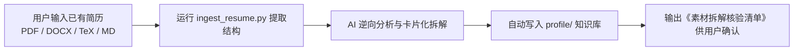

# 简历智能摄取与冷启动 (ingest-profile)

> 本文件是 `job-finding` 技能在**用户冷启动与素材导入阶段**的核心参考文档，由 `SKILL.md` 按需加载；路径均相对仓库根目录。

---

## 核心目标与现实痛点解决

**痛点**：现实场景中，用户初次使用绝不可能逐个手工创建几十个 Markdown 卡片。用户的典型第一步动作通常是：
> *“这是我以前的简历（PDF / Word / LaTeX / Markdown），你帮我拆解并存入素材库。”*

**解决方案**：本工作流实现**免门槛零摩擦冷启动（Zero-Friction Ingestion）**：
1. 自动化解析多格式文件，提取结构化段落；
2. AI 智能逆向分流并自动生成结构化素材：
   - 个人全集：`profile/master-resume.md`
   - 工作经历卡：`profile/work/<公司名>.md`
   - 核心项目卡：`profile/projects/<项目名>.md`
   - 专业技能库与资格证书
3. 生成《素材库拆解确认表》，人在回路（HITL）快速追认，即可立即开启后续针对性 JD 定制！

---

## 一、 执行流水线



### 步骤 1：运行确定性提取脚本
在终端或子进程中调用内置脚本：
```bash
python .agents/skills/job-finding/scripts/ingest_resume.py "<用户简历路径>" --out profile/ --json
```
- 脚本自动探测后缀：
  - `.pdf`：利用 PyMuPDF 抽取文本层并标定页码；
  - `.docx`：原生解包 XML 文本节点，零环境依赖；
  - `.tex`：自动剥离 LaTeX 格式宏与环境声明；
  - `.md` / `.txt`：多编码自适应读取。

---

## 二、 智能逆向拆解标准

从提取出的全量文本中，AI 依据以下规则自动填充 `profile/` 目录：

### 1. 沉淀至 `profile/master-resume.md`
- 汇总姓名、联系方式、个人总结、教育背景、全部工作经历、全部项目、技能栈与证书。

### 2. 自动拆分经历卡至 `profile/work/<公司名>.md`
每个工作段落自动拆解为单卡片：
```markdown
# 经历卡：[公司名称]

- 时间：YYYY.MM ~ YYYY.MM
- 角色：[职位名称]
- 部门/业务线：[业务线]

## 核心职责与业务战果
- [提取出的成就语句 1，标注量化指标]
- [提取出的成就语句 2]

## 原始素材关键信息
- [技术栈/工具]
- [下属/团队规模]
```

### 3. 自动拆分项目卡至 `profile/projects/<项目名>.md`
针对每个独立项目生成项目卡：
- 若原文中包含 GitHub 仓库链接或本地路径，自动填充入元数据；
- 若缺少量化指标，保留原句并标注 `[需补充量化数据]`；
- 提示用户补充代码仓库链接，以便后续触发深度代码审计。

---

## 三、 人在回路交付清单 (Ingestion Checklist)

AI 在完成文件摄取与落盘后，必须向用户输出结构化总结：

```markdown
### 🎉 简历素材已成功导入并沉淀至知识库！

- **原始文件**：`my_resume.pdf` (提取字符数：1,842)
- **已生成的主简历**：`profile/master-resume.md`
- **已拆解的工作经历卡**：
  - `profile/work/字节跳动.md` (2023.06 ~ 至今)
  - `profile/work/腾讯科技.md` (2021.07 ~ 2023.05)
- **已拆解的项目卡**：
  - `profile/projects/cloud-gateway.md`
  - `profile/projects/distributed-scheduler.md`
- **待用户核实的事项**：
  1. 请检查 `profile/master-resume.md` 中的手机号和邮箱是否正确；
  2. 如果项目有公开 GitHub 仓库或本地代码路径，建议填入项目卡，AI 可进一步深度扫描代码为你提炼硬核技术亮点；
  3. 确认无误后，你随时可以丢给我一个目标 JD 开始定制简历！
```
