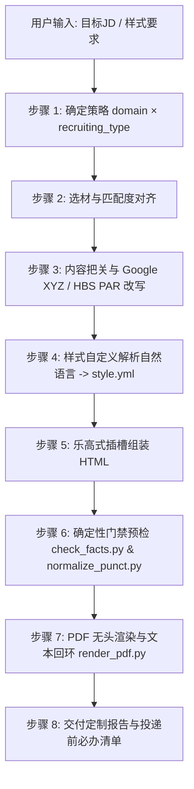

# 简历定制与内容把关 (Resume Tailoring)

> 本文件是 `job-finding` 技能的核心参考文档，由 `SKILL.md` 按需加载；路径均相对求职仓库根目录。

---

## 核心原则 (红线约束，违反即任务失败)

1. **`profile/` 素材库是唯一事实来源 (Source of Truth)**：**绝对只读**。简历产出中的任何经历、项目、公司、职务、数字、周期、技术栈必须能在 `profile/` 的具体素材卡或 `master-resume.md` 中追溯到确凿出处。
2. **关键词二分注入法**：
   - **可注入 (Injectable)**：素材库中有对应真实事实，仅措辞与 JD 表达不同 $\rightarrow$ 允许重组措辞或规范化命名。
   - **不可注入 (Non-injectable)**：素材库中完全无此事实 $\rightarrow$ 绝对不可捏造！一律列入差距清单（Gap List），引导用户补充真实经历或在求职信中说明。
3. **改写留痕与人在回路 (Reframing & HITL)**：所有对经历的深度提炼与润色，必须在生成报告中完整呈现 `before (原素材) / after (定制后) + 事实依据`，并经用户追认。
4. **ATS 100% 解析安全**：单栏标准排版、标准语义化标签（`h1`, `h2`, `h3`, `p`, `ul`, `li`）、无复杂嵌套多栏表格、无阻碍文本抽取的图标与背景杂色。

---

## 详细定制流程



---

### 步骤 1：确定策略 (Strategy Resolution)

在着手组织内容前，首先依据 `references/strategy-packs.md` 确立两大维度：
1. **职业领域 (`domain`)**：
   - `tech-engineering` / `finance-accounting` / `hr-people` / `product-operations` / `marketing-sales` / `design-creative` / `data-science-analytics` / `generic-business`
   - 从 JD 的岗位名称与职责中推断，或直接询问用户；
2. **招聘类型 (`recruiting_type`)**：
   - `campus` (校招/应届生)：**教育背景置顶第一屏**，重点凸显 GPA、学术奖项、基础能力与课程项目，严格 1 页。
   - `social` (社会招聘)：**工作经历置顶第一屏**，倒序详细展现量化战果，教育背景压缩并后置垫底，1~2 页。
   - `internship` (日常/在校实习)：教育置顶，明确标注每周到岗天数与实习周期。

---

### 步骤 2：精选素材与关键字匹配

1. 检索 `profile/` 目录下的所有素材卡（经历卡 `work/`、项目卡 `projects/`、技能库等）。
2. 对照 JD 核心要求，挑选最相关的 **3~4 段核心经历/项目**，非核心或相关度极低的内容坚决舍弃或合并压缩。
3. 提取 JD 核心高频关键词（具体技术栈、业务工具、方法论），标记可注入与不可注入项。
4. **项目代码轻量化引用（无需复制全量代码）**：
   - 若项目卡中提供了本地目录或公开 GitHub 链接（如 `https://github.com/username/repo`），AI 可直接通过其 README 与关键结构提炼技术亮点，并在简历项目标题旁以优雅链接/元信息呈现（如 `| GitHub: username/repo`）；
   - ⚠️ **归属防翻车自查**：严格确认该项目为候选人本人独立编写、主导或拥有核心提交历史。严禁将他人高星开源项目冒充为个人经历（避免技术面试现场 Whiteboard 撕底层或 Review 代码时被当场揭穿）。

---

### 步骤 3：内容深度把关与质量门禁 (Content Quality Gate)

对照 `docs/RESUME-CONTENT-GUIDE.md` 对每条 Bullet 进行逐字审查：

1. **Google XYZ 黄金公式检验**：
   - 检查是否满足：`Accomplished [X] as measured by [Y], by doing [Z]`。
   - 是否有清晰的业务成果 [X]、量化指标 [Y]、以及具体实施手段 [Z]。
2. **消灭反模式 (Anti-Patterns Elimination)**：
   - ❌ **严禁职责罗列**：“负责系统开发维护” $\rightarrow$ ✅ 改写为具备业务影响力的成就语句。
   - ❌ **严禁软弱动词单开**：消灭“参与/协助/跟进/配合”开头的句子 $\rightarrow$ ✅ 换用 Harvard 强动作动词（如“主导架构重构”、“独立研发鉴权模块”）。
   - ❌ **严禁空洞形容词**：剔除“具备极强抗压能力”、“精通”、“为人热情”等自嗨修饰词。
   - ❌ **严禁无结果孤岛**：任何实施动作必须交代产出成果（性能、效率、成本、稳定性）。
3. **真实性熔断**：素材中无明确数据的，以业务规模（如“服务 40+ 接入方”、“承载日均 200 万次调用”）量化，**绝对不许虚构捏造不存在的指标**。

---

### 步骤 4：样式自定义解析 (Natural Language $\rightarrow$ Schema)

用户可以用自然语言随心提出任何样式偏好，AI 接入时必须精准映射到 `templates/style.yml`：

| 用户自然语言示例 | 映射的 Schema 配置项 | 生效机制与效果 |
|---|---|---|
| “换个墨绿色 / 森林绿” | `theme_palette: emerald-tech` (或 `colors.accent: "#0f766e"`) | 写入 `:root { --accent: #0f766e; }` |
| “换成投行黑白 / 严谨黑白” | `theme_palette: wallstreet-mono` | 标题与分割线均使用高质感黑灰 |
| “标题居中 / 居左 / 左右对齐” | `header.align: center` / `left` / `split` | Header 添加 `.header-center` / `.header-left` / `.header-split` 类 |
| “我是应届生，把学历放第一位” | `sections: [education, work, projects, skills, awards]` | 渲染时教育经历直接拼接在 Header 下方 |
| “不要概述，加上专业证书” | `sections` 中移除 `summary`，添加 `certifications` | 不渲染概述块，插入资质证书模块 |
| “技能展示换成小胶囊/标签” | `skills_style: pill-badges` | 技能项渲染为带有浅底色的现代圆角 Badge |
| “内容太多放不下一页，紧凑点” | `density: compact` | 字号调为 10pt、行距 1.35、节间距 8pt |
| “风格换成现代科技款 / 卓越居中款 / 极简留白款” | `archetype: v4-modern-pill` / `v5-executive-center` / `v6-minimal-clean` | 切换选用的 HTML 基础骨架 |

*注：金融领域策略强制黑白一页纸（Wall Street Monochrome），若用户要求彩色，需在报告中提示规范冲突。*

---

### 步骤 5：乐高式插槽组装 HTML (Slot Assembly)

1. 读取选定的骨架模板（`templates/resume-template-*.html`）。
2. 将 `:root` 中的 CSS 变量替换为 `style.yml` 中的色值与排版密度。
3. 填充 Header 区域（姓名、联系方式、Tagline 定位、对齐类名）。
4. **核心组装**：遍历 `style.yml` 的 `sections` 列表，按照该列表的先后顺序，从 `templates/modules/` 中提取对应模块的 HTML 代码块，填入素材数据后，顺次拼接到 `{{SECTIONS_CONTENT}}` 插槽中！
   - `summary`: 专业定位概述
   - `education`: 教育经历（校招含 GPA/课程/荣誉；社招为精简单行）
   - `work`: 倒序工作经历 + Google XYZ 成果 Bullet
   - `projects`: 标志性项目 + 角色与技术栈 + 量化影响
   - `skills`: 专业技能（依 `skills_style` 渲染为列表或胶囊）
   - `certifications`: 执业资质与证书
   - `awards`: 竞赛荣誉与奖项
   - `custom`: 自定义模块
5. 组装完毕后归整保存至目标公司专属交付包目录：`resumes/tailored/<公司>/resume.html`（定制源文本为 `resume.md`）。

---

### 步骤 6：确定性门禁预检 (Deterministic Verification)

在交付给用户前，必须依次运行技能内置脚本进行校验：

1. **中文标点归一化**（幂等执行，确保中文标点全角，避免排版瑕疵）：
   ```bash
   python .agents/skills/job-finding/scripts/normalize_punct.py resumes/tailored/<公司>/resume.md resumes/tailored/<公司>/resume.html
   ```
2. **事实追溯预检**（自动提取所有量化数字与日期，在 `profile/` 素材中进行第一道机械匹配）：
   ```bash
   python .agents/skills/job-finding/scripts/check_facts.py resumes/tailored/<公司>/resume.md
   ```
   *如报错 exit 1，必须立即查明出处并修正，绝不带病交付！*

---

### 步骤 7：PDF 渲染与文本抽取回环 (Headless Render & ATS Audit)

运行无头浏览器渲染与 PyMuPDF 双重核验：
```bash
python .agents/skills/job-finding/scripts/render_pdf.py \
    resumes/tailored/<公司>/resume.html \
    resumes/tailored/<公司>/resume.pdf \
    --must "姓名,核心手机号,核心技术关键词" \
    --max-pages 1 \
    --preview resumes/tailored/<公司>/preview.png
```
- **门禁判据**：
  - 页数：必须 $\le$ 最大允许页数（校招/社招常规一页）；
  - 提取率：`--must` 关键词必须 100% 成功抽取（确保 ATS 机器解析无损）；
  - 版面填充率：目标区间 **80% ~ 95%**（若偏高溢出两页则升至 compact 密度；若偏低则升至 airy 密度）。

---

### 步骤 8：生成定制报告 (Generation Report)

在 `resumes/tailored/<公司>/report.md` 输出结构化交付报告（与该公司的简历文件同目录内聚，无需跨目录查找）：
1. **策略选择**：领域与招聘类型判定依据；
2. **选材理由**：为何选取这 3~4 段经历与项目；
3. **改写留痕 (Reframing Diff)**：逐条列出 `[Before]` $\rightarrow$ `[After]` 及事实依据；
4. **验证结论**：页数、ATS 关键词抽取率与填充率。
4. **关键词覆盖与差距清单 (Gap List)**：列出成功注入的关键词与未覆盖的差距点；
5. **样式与版面参数**：模板骨架、配色方案、模块顺序与实测填充率；
6. **投递前必办清单 (Pre-flight Checklist)**：占位符替换（电话、邮箱）、用户最终追认。